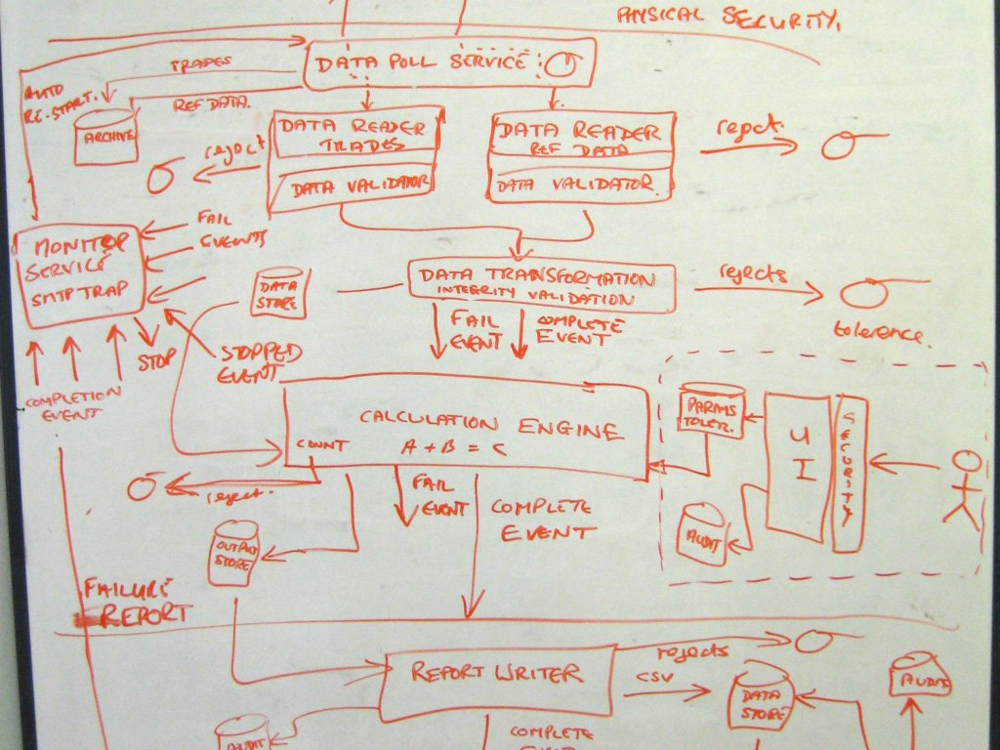

layout: true
class: typo, typo-selection
count: false

---
class: center, middle

# C4 Model 101

<small>Or how I learned to stop worrying and love diagrams</small>

---

# The preamble

Kindly install plantuml

> brew install plantuml

if you're on a mac. 

---

# The preamble

Heaven help you if you're on Windows.

> @"%SystemRoot%\System32\WindowsPowerShell\v1.0\powershell.exe" -NoProfile -ExecutionPolicy Bypass -Command "iex ((New-Object System.Net.WebClient).DownloadString('https://chocolatey.org/install.ps1'))" && SET "PATH=%PATH%;%ALLUSERSPROFILE%\chocolatey\bin"

> choco install plantuml

---
class: center, middle

# The problem

Software engineers *suck* at making diagrams

--

And they don't know it

---
# The problem


---
# The problem




---
class: center, middle

> Do we have a diagram of the architecture?

--

I have .serif[no idea] what this question means

---
class: center, middle, nord-dark

# The solution

## Use the C4 Model

---

# The checklist

### General

* Does the diagram have a .serif[title]?
* Do you understand what the diagram .serif[type] is?
* Do you understand what the diagram .serif[scope] is?
* Does the diagram have a .serif[key/legend]?

---

### Elements

* Does every element have a .serif[name]?
* Do you understand the .serif[type] of every element?
* Do you understand what every element .serif[does]?
* Do you understand the .serif[technology] choices of each element?
* Do you understand the .serif[style] of each element?
* Do you understand the .serif[meaning] of all acronyms and abbreviations?

---

### Relationships

* Does every line have a .serif[label] describing the relationship?
* Do you understand the .serif[meaning] of all acronyms and abbreviations?
* Do you understand the .serif[style] of each element?

---
# The problem


---
# Context Diagrams


---
# Container Diagrams


---
# Component Diagrams


---
# Code Diagrams


---
# The C4 Model


---
# Plantuml and C4

```
@startuml

title System Context diagram for Internet Banking System

Person(customer, "Personal Banking Customer", "A customer of the bank")
System(banking_system, "Internet Banking System")

System_Ext(mail_system, "E-mail system")
System_Ext(mainframe, "Mainframe Banking System")

Rel(customer, banking_system, "Uses")
Rel_Back(customer, mail_system, "Sends e-mails to")
Rel_Neighbor(banking_system, mail_system, "Sends e-mails", "SMTP")
Rel(banking_system, mainframe, "Uses")
@enduml
```
---
# The C4 Model


